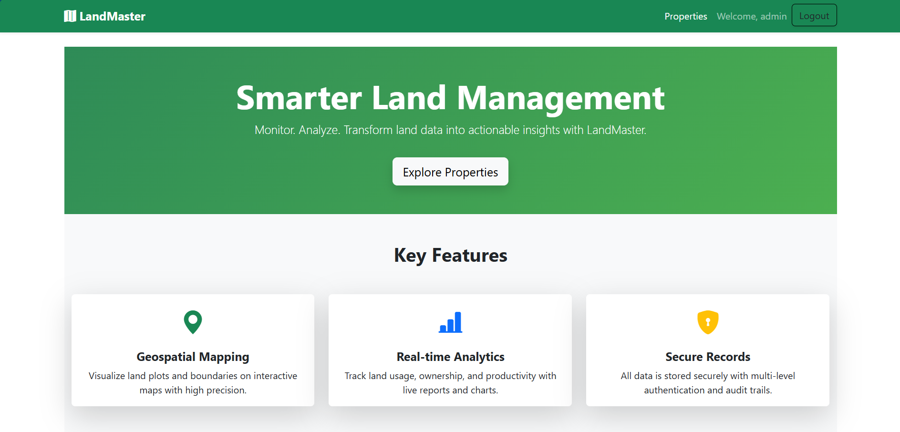
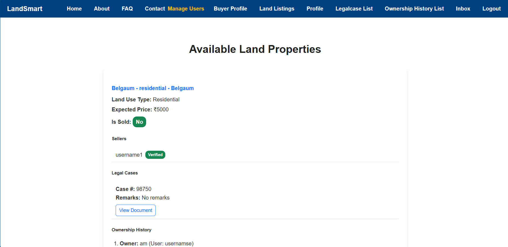
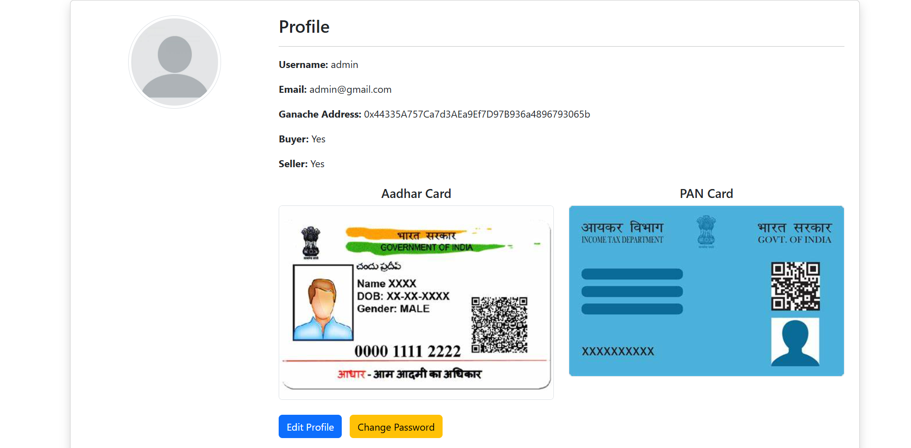
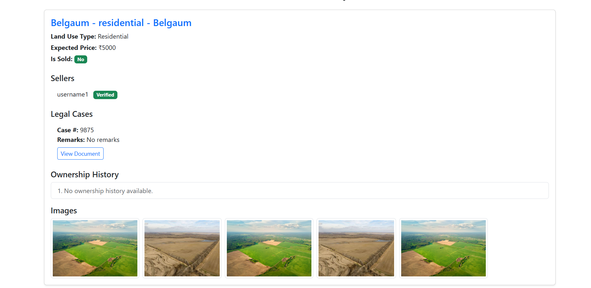

# 🏞️ Land Management System (LMS)

A Django-based full-stack web application to manage land records, legal history, and transactions with blockchain-based registration using MetaMask and Ganache. Built with dynamic role-based access, verification indicators, and quick navigation to streamline real estate workflows for buyers, sellers, and administrators.

---

## 📸 Screenshots






---

## ⚙️ Features

### 🔐 Blockchain-Based Registration
- Secure user authentication via **MetaMask wallet**.
- User identities and credentials are stored on a **private Ethereum blockchain (Ganache)**.
- Registration and login actions are recorded immutably.

### 👥 Role-Based Access Control
- **Buyers**: Browse properties, post requirements, chat with sellers.
- **Sellers**: List properties, upload legal documents, track interest.
- **Admins**: Verify profiles, manage ownership and legal records.

### 🏷️ Dynamic Badges and UI Indicators
- **Verified** badge using Bootstrap 5 `badge` components.
- Real-time role indicators (`Seller`, `Buyer`, `Admin`) with color-coded labels.
- Status tags for document verification, legal clearance, etc.

### 📁 Property & Ownership Records
- Add/view land properties, ownership history, transfer timeline.
- Upload documents (e.g., Aadhar, PAN, legal papers).
- Verify property status and dispute history.

### ⚖️ Legal Case Management
- View, register, and track legal cases tied to properties.
- Admin verification and legal record association.

### 💬 Integrated Messaging System
- 1-to-1 and group chat with image support using Bootstrap cards and modals.
- Notifications for new messages and replies.

---

## 🧭 Quick Navigation

- 🏠 **Dashboard**: Role-specific overview and stats
- 📜 **Legal Cases**: List and manage property disputes
- 🧾 **Ownership History**: Visual timeline for land transfers
- 👤 **Profile**: Aadhar/PAN uploads, blockchain-linked status
- 💬 **Messages**: Realtime chat with buyer-seller filtering

---

## 🛠️ Tech Stack

- **Backend**: Python, Django, Django REST Framework
- **Frontend**: Bootstrap 5, JavaScript, Font Awesome
- **Blockchain**: Ganache (Ethereum test blockchain), MetaMask wallet
- **Database**: SQLite 
- **Authentication**: MetaMask wallet login + Django session

---

## 🧑‍💻 Setup Instructions

1. **Clone the Repo**
   ```bash
   git clone https://github.com/rohan98805/landmanagementsystem.git
   cd landmanagementsystem

## 🌐 Live Demo

You can access the deployed Land Management System at:

[http://16.171.144.7/](http://16.171.144.7/)
